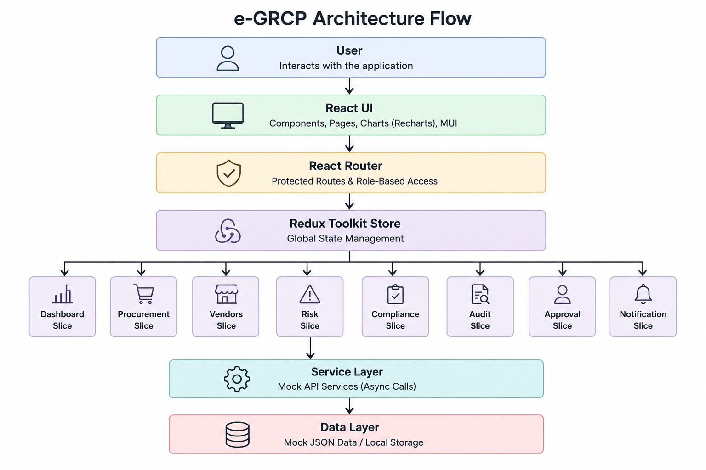

# e-GRCP — Enterprise Governance, Risk, Compliance & Procurement Platform

A production-grade enterprise SaaS frontend application built with React 19, Vite, Redux Toolkit, MUI, and Recharts.

## 🚀 Quick Start

```bash
npm install --legacy-peer-deps
npm run dev        # http://localhost:3000
npm test           # Run all tests
npm run build      # Production build
```

## 🔑 Demo Credentials

| **Role**               | **Name**        | **Email**                 | **Password**     |
| ---------------------- | --------------- | ------------------------- | ---------------- |
| **Admin**              | Michael Johnson | `mrs.johnson@egrcp.com`   | `Admin@123`      |
| **Manager**            | Michael Brown   | `michael.brown@egrcp.com` | `Manager@123`    |
| **Compliance Officer** | Emma Davis      | `emma.davis@egrcp.com`    | `Compliance@123` |

## 📁 Project Structure

```
src/
├── __mocks__/          # Jest file mocks
├── __tests__/          # Test suites (50 tests, 8 suites)
├── components/
│   ├── common/         # KpiCard, StatusChip, ErrorBoundary, etc.
│   └── layout/         # AppHeader, AppSidebar, AppLayout
├── mocks/              # Mock JSON data (users, vendors, requests, risks, etc.)
├── pages/
│   ├── auth/           # Login, ForgotPassword, ResetPassword, SessionExpired
│   ├── dashboard/      # Executive Dashboard with KPIs and charts
│   ├── procurement/    # List, Detail, Create Request pages
│   ├── vendors/        # Vendor List and Detail pages
│   ├── risk/           # Risk Center with heat matrix
│   ├── compliance/     # Compliance Center
│   ├── audit/          # Audit Center
│   ├── approval/       # Approval Workbench
│   ├── notifications/  # Notification Center
│   ├── reports/        # Reporting Center with CSV export
│   └── settings/       # User Settings
├── services/           # Mock API services (simulated async calls)
├── store/
│   ├── index.js        # configureStore with redux-persist
│   └── slices/         # 10 Redux Toolkit slices
└── theme/              # MUI light/dark themes
```

## 🏗 Architecture Flow

<p align="center">
  
</p>

## 🧪 Testing

```bash
npm test                    # Run all tests with coverage
```

- 8 test suites, 50 tests
- Covers: Redux slices, services, React components
- Framework: Jest + React Testing Library
